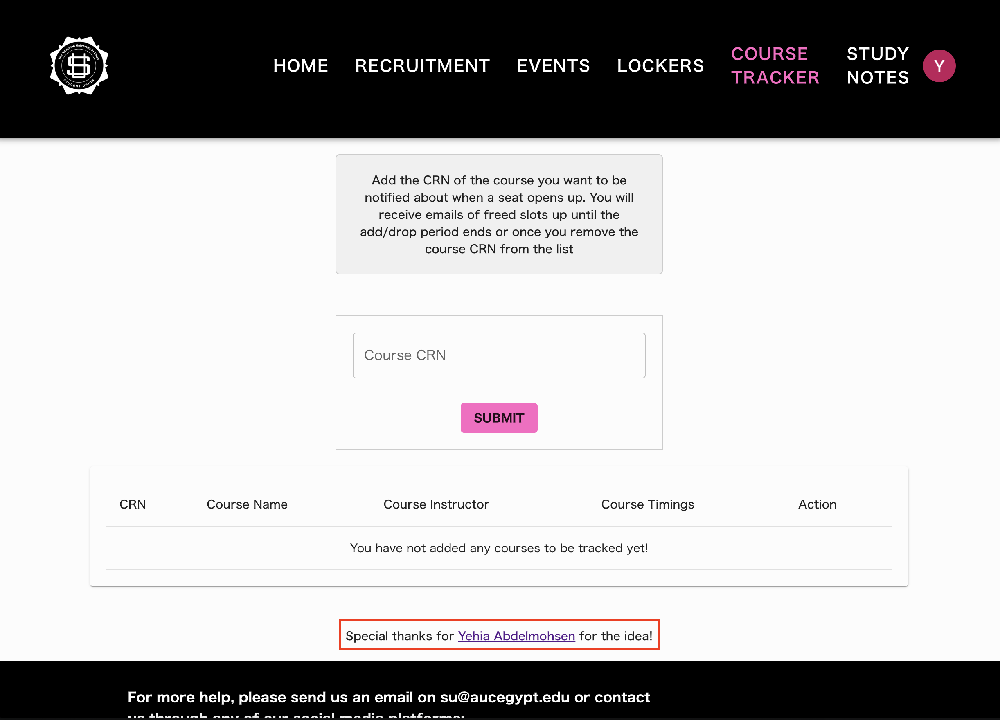
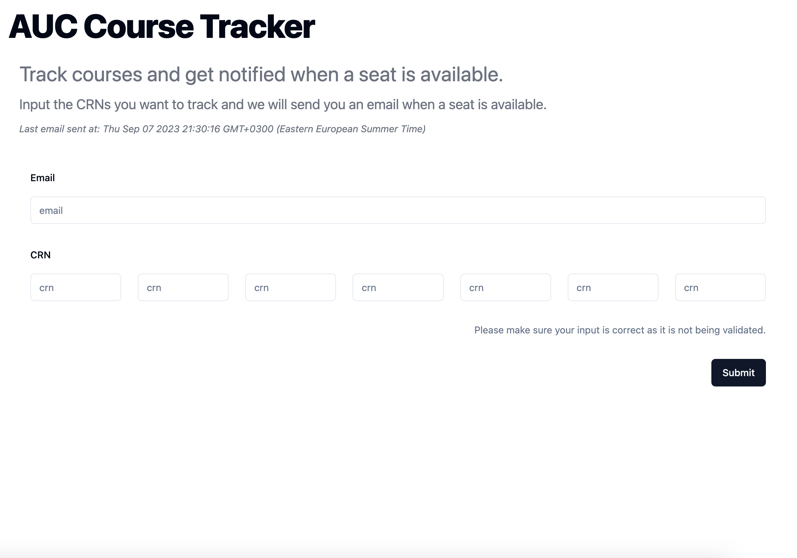
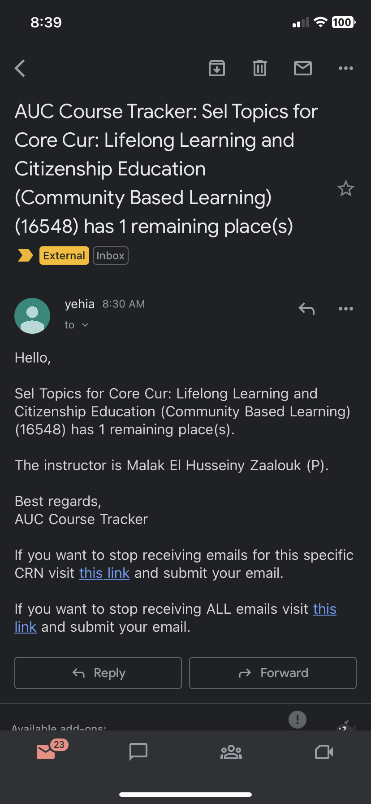

# AUC course tracker

For the record

*Update: As of Jan 23, 2024. I've handed over the code to the Student Union tech team.*

I want to avoid a stupid core course and focus on the math and CS courses I'm taking. The ideal course with low workload has 0 remaining seats. So I made this app to check two times every hour if there are empty seats (someone dropped the course). I documented my progress while building the app.

Will turn the cron jobs off after September 7, 2023 (drop and add deadline).

## Timeline

### 1:37 AM, Tue 5 Sep

I need to register a course, but don't want to keep checking self service banner. The university has an open "Dynamic Schedule" so it shouldn't be hard to run a cron job to programmatically check if a course has empty slots. After a quick chat with Seif Shalan, creator of https://gadwal.co, this should be easy.

### 1:53 AM

I actually don't need to store all the courses in the database (my initial conclusion). (Push)

### 3:45 AM

Don't know why this took so long, but the database and form submission works for now. (Push)

### 4:45 AM

Wrote the code for the webhook that should be called ~2 times an hour (maybe more?). This webhook fetches fresh course data and checks whether any of the CRNs that are already in the database have any remaining places (>0). If yes, it sends an email to everyone who is tracking these courses.

Two main challenges here:

1. Vercel serverless functions timeout after 10 seconds (on the free plan), so I might have to just look for an alternative if the function doesn't execute fast enough.
2. I don't know if the email sending will be the bottle neck. Right now it's finishing after around 6.7s, without sending any emails.
   (Push)

### 5:11 AM

Setup cron job on mergent. They have a generous (?) free tier with 1,000 invocations, should be enough for the week. Drop and add ends September 7th, so we will probably need around (24+24+12)\*2=120 invocations if I release at 12:00PM on Tue 5 Sep. Hope my math is right.

### 5:51 AM

Okay cron job on mergent doesn't seem to be working. Serverless execution time not an issue anymore, deploying on a pro plan. (Push)

### 6:20 AM

Cron job is working. First email received.

### 6:28 AM

Probably the final push today. Edge case: if there are a lot of spots in a course it will keep sending emails, but logically who would input a course that has seats left.

### 7:13 AM

Had to add an opt out option, would be rude not to. Will turn off webhooks in two days, so it won't matter much. But just in case. (Push)

### 3:08 PM

Now storing sent emails. Should have done this from the beginning.

### 12:35 AM, Wed 6 Sep

Added more complete opt out. Users are now able to opt out of a specific course OR all courses.

### 8:30 AM (Got the course I want!)

### 9:02 PM, Thu 7 Sep

As the 12:00 AM deadline approaches I increased the cron jobs to hit the endpoint 4 times an hour instead of 2.

### 3:07 PM, Fri 8 Sep

Turned off cron jobs, see you next semester!
